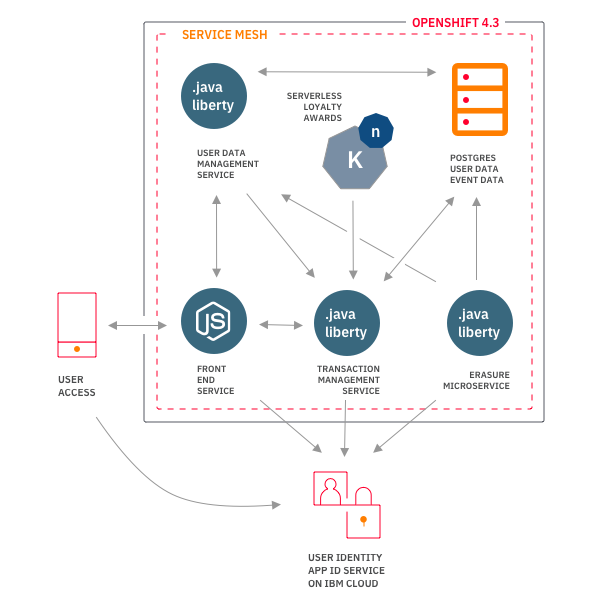

# OpenShift Service Mesh for Example Bank



## Part 1: Deploy Example Bank

Login and checkout Example Bank github repo.

```
oc login
ibmcloud login -u <account name>
git clone https://github.com/IBM/example-bank.git
oc new-project example-bank
```

```
cd example-bank/scripts/
./createappid.sh
./createsecrets.sh
./deploy-db.sh
./installServerlessOperator.sh
```
* Note: Verify the `creditdb` database pod is in Running state before running the SQL schema loader.

Deploy front end service and SQL data schema.

```
oc apply -f deployment.yaml
oc apply -f data_model/job.yaml
```

Verify schema loaded to ensure the database is ready to use.

```
oc logs cc-schema-load-<pod>
```

Deploy back-end services:

```
oc apply -f bank-app-backend/transaction-service/deployment.yaml -f bank-app-backend/user-service/deployment.yaml
```

Deploy the Serverless (knative) service.

```
cd bank-knative-service/
oc apply -f deployment.yaml
```
Verify it's running:

```
oc get kservice
```

At this point we can verify the app is running prior to setting up service mesh. 
We are using an OpenShift route.

```
oc get routes
```
Visit URL for the mobile simulator route.

# Part 2: Service Mesh Setup

Open up the OpenShift console, navigate to the the OperatorHub, install operators in this order:

 1. Elastic Search (choose version 4.3)
 2. Jaeger Operator
 3. Kiali
 4. Service Mesh Operator

Create a new project called `istio-system`.

Go to installed operators, and wait until they become available in this namespace.

While waiting, check out the `service-mesh` branch:

```
git checkout service-mesh
````

### Next steps:

- Create Control Plane instance.

- Create ServiceMeshMemberRolls

Verify install: 

```oc get smmr -o yaml --all-namespaces | egrep -A2 'ControlPlane|configuredMembers'```


Open up a second terminal to watch pods: `watch -n1 oc get pods`

Deploy with sidecar enabled:

```
oc apply -f bank-app-backend/user-service/deployment.yaml -f bank-app-backend/transaction-service/deployment.yaml -f deployment.yaml
```

Patch database pod to inject the Istio sidecar.

```
kubectl patch deployments.apps creditdb -p '{"spec":{"template":{"metadata":{"annotations":{"sidecar.istio.io/inject":"true"}}}}}'
```

Delete route and replace with Istio ingress gateway:

```
oc delete routes --all
oc apply -f bank-istio-gw.yaml
```

Force mTLS between database and other services:

```
oc apply -f bank-istio-policy.yaml -f bank-istio-destination-mtls.yaml
```

Enable knative-serving with Istio.

```
./label-knative.sh
```

This sets the appropriate labels in the `knative-serving` namespace allowing the knative service to be triggered.

Redeploy the knative service with the Istio sidecar annotation.

```
oc apply -f bank-knative-service/network.yaml
oc apply -f bank-knative-service/deployment.yaml
```

>  We are updating the cleanup utility because we need to send a signal to the Envoy sidecar to exit after the job completes.

```
oc delete -f bank-user-cleanup-utility/job.yaml
oc apply -f bank-user-cleanup-utility/job.yaml
```

> Expose access via OpenShift secured route. Go to istio-system namespace in Admin console.

Set port 80 -> 8080, Edge, Redirect.  Default OpenShift certs can be used, or you can upload your own certificates.

> Click on URL, e.g. https://example-bank-istio-system.first-test-cluster-f8c169e6934c89d328b2b987ec7f7018-0000.us-south.containers.appdomain.cloud/

> Click on "Padlock" to examine certs.

> Use bank simulator. Note that all relevant pods have extra container.

> Open up Kiali from App square to view traffic flow.
